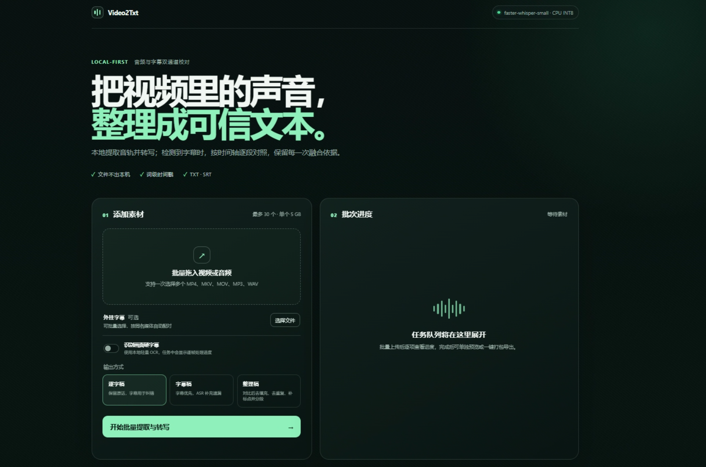

# 视频转文本（Video2Txt）

Video2Txt 是一个**本地优先的视频/音频转写与字幕融合工具**。它使用本地 faster-whisper 将音频转换为带时间戳的文本，并可结合外挂字幕、视频内嵌文本字幕或画面硬字幕进行时间轴对齐和融合，最终导出逐字稿、字幕稿以及结构化结果。

所有媒体、模型和识别结果都在本机处理，不依赖在线 API，也不会将原始素材上传到第三方服务。



*Video2Txt 本地 Web 工作台预览*

> 当前版本：`V1.0.0`。项目仍在持续完善中，详细设计和开发进度请参阅 [DEVELOPMENT.md](DEVELOPMENT.md)。

## 功能特性

- **本地语音识别**：基于 faster-whisper，支持中文识别、词级时间戳、VAD 和 CPU/GPU 配置。
- **媒体自动探测**：使用 FFprobe 识别视频、音频和字幕流，并支持选择指定音轨或字幕流。
- **字幕处理**：支持外挂及内嵌文本字幕，解析 SRT、ASS、SSA、VTT 等常见格式，并处理常见编码和样式控制符。
- **字幕融合**：根据时间重叠、文本相似度和置信度进行对齐，保留融合决策和复核信息。
- **硬字幕 OCR**：可选使用 PaddleOCR 识别画面底部的压制字幕，并记录抽帧、跳帧、识别次数和置信度。
- **三种输出模式**：
  - `verbatim`：以 ASR 为正文，尽量保留原始口语内容。
  - `subtitle`：以字幕为主，使用 ASR 补充缺失内容。
  - `clean`：在可追溯融合结果上进行去填充词、去相邻重复、补标点和分段。
- **命令行与 Web 界面**：既可使用 CLI 批处理，也可启动本地 Web 工作台。
- **批量任务管理**：Web 界面支持最多 30 个媒体文件、同名字幕自动配对、进度查看、失败重试、任务删除和结果预览。
- **可追溯输出**：同时保存 TXT、SRT、JSON 和任务清单，便于复核、二次处理和问题定位。
- **本地缓存**：相同音频和识别参数会复用 ASR 缓存，减少重复计算。

## 工作流程

```text
视频/音频
  ├─ 音轨 ─────────────→ 音频标准化 → faster-whisper ASR ─┐
  └─ 外挂/内嵌字幕或画面 ─→ 解析/OCR ───────────────────┤
                                                        ├─→ 时间轴对齐
                                                        ├─→ 文本融合
                                                        └─→ TXT / SRT / JSON
```

## 环境要求

- Python `3.11` 至 `3.13`，推荐 Python `3.12`。
- FFmpeg 和 FFprobe，并确保它们可以在终端中直接调用：

  ```bash
  ffmpeg -version
  ffprobe -version
  ```

- 一个本地 faster-whisper 模型目录，例如 `faster-whisper-small`。项目不会自动替用户下载模型，模型目录需要提前准备好。
- 推荐至少 8 GB 内存。模型越大、视频越长，所需内存和处理时间越高。
- 若启用硬字幕 OCR，还需要安装 PaddleOCR 和 PaddlePaddle；默认配置使用 CPU。

## 安装

### Windows PowerShell

```powershell
git clone <your-repository-url>
cd video2txt

py -3.12 -m venv .venv
.\.venv\Scripts\python.exe -m pip install --upgrade pip
.\.venv\Scripts\python.exe -m pip install -e ".[asr,subtitles,ocr,web,dev]"

.\.venv\Scripts\video2txt.exe version
```

### Linux / macOS

```bash
git clone <your-repository-url>
cd video2txt

python3.12 -m venv .venv
source .venv/bin/activate
python -m pip install --upgrade pip
python -m pip install -e ".[asr,subtitles,ocr,web,dev]"

video2txt version
```

可按需选择依赖组：

| 依赖组 | 用途 |
|---|---|
| `asr` | faster-whisper 本地语音识别 |
| `subtitles` | 字幕解析、文本相似度和繁简处理 |
| `ocr` | PaddleOCR 硬字幕识别 |
| `web` | FastAPI 本地 Web 界面 |
| `dev` | pytest、pytest-cov 和 Ruff |

例如，只使用命令行 ASR 和字幕融合功能：

```bash
python -m pip install -e ".[asr,subtitles]"
```

如果暂时不需要硬字幕 OCR，可以不安装 `ocr` 依赖；首次启用 PaddleOCR 时，OCR 模型可能会自动下载到本地缓存目录。

## 配置模型和 FFmpeg

复制示例配置文件：

```powershell
Copy-Item config.example.toml config.toml
```

编辑 `config.toml`，至少设置本地模型路径：

```toml
[asr]
model_path = "D:/models/faster-whisper-small"
language = "zh"
device = "cpu"
compute_type = "int8"

[ffmpeg]
ffmpeg_path = "ffmpeg"
ffprobe_path = "ffprobe"
```

也可以通过环境变量指定配置：

```powershell
$env:VIDEO2TXT_MODEL_PATH = "D:\models\faster-whisper-small"
$env:VIDEO2TXT_CONFIG = "D:\Coding\video2txt\config.toml"
```

配置优先级为：命令行参数 `--model-path` > `VIDEO2TXT_MODEL_PATH` > 配置文件。常用路径环境变量还包括 `VIDEO2TXT_WORK_DIR` 和 `VIDEO2TXT_OUTPUT_DIR`。

查看最终配置：

```bash
video2txt show-config --config config.toml
```

## 快速开始

### 使用命令行完成转写

最简单的完整转写命令：

```bash
video2txt transcribe input.mp4 \
  --config config.toml \
  --output-dir output/demo \
  --mode verbatim
```

指定外挂字幕：

```bash
video2txt transcribe input.mp4 \
  --external-subtitle input.srt \
  --config config.toml \
  --output-dir output/demo \
  --mode subtitle
```

识别画面中的压制硬字幕：

```bash
video2txt transcribe input.mp4 \
  --hard-subtitles \
  --config config.toml \
  --output-dir output/demo
```

Windows PowerShell 请将行尾的 `\` 换成 PowerShell 续行符 `` ` ``，或将命令写成一行。

其他常用命令：

```bash
video2txt probe input.mp4
video2txt extract-audio input.mp4 --output work/audio.wav
video2txt extract-subtitles input.mkv --output work/subtitles.srt
video2txt parse-subtitles input.srt --output work/subtitles.json
```

### 启动本地 Web 界面

确保安装了 `web` 依赖后运行：

```bash
video2txt serve --config config.toml
```

然后打开 <http://127.0.0.1:8765/>。

也可以直接传入模型路径：

```bash
video2txt serve \
  --model-path D:/models/faster-whisper-small \
  --host 127.0.0.1 \
  --port 8765
```

Web 界面支持：

- 批量上传视频或音频，单文件最大 5 GB，单批最多 30 个文件；
- 按文件名自动匹配外挂字幕；
- 选择逐字稿、字幕稿或整理稿模式；
- 可选启用硬字幕 OCR，并查看逐帧进度；
- 查看历史任务、文本预览、失败原因并重试；
- 单独下载 TXT、SRT，或将两者打包为 ZIP；
- 管理工作文件、输出文件、上传素材和识别缓存。

## 输出文件

默认结果保存到 `output/<task-id>/`：

| 文件 | 说明 |
|---|---|
| `transcript.txt` | 最终文本结果 |
| `subtitles.srt` | 融合后的 SRT 字幕 |
| `asr.json` | ASR 分段、词级时间戳、概率和推理参数 |
| `subtitle_raw.json` | 原始字幕解析结果 |
| `fusion.json` | 时间轴对齐、相似度、融合决策和复核标记 |
| `ocr_observations.json` | 启用硬字幕 OCR 时的抽帧和识别记录 |
| `transcript_source.txt` | `clean` 模式清理前的融合文本 |
| `probe.json` | FFprobe 媒体信息和流信息 |
| `task.json` | 任务状态、参数、警告和产物清单 |

中间文件和 ASR 缓存默认位于 `work/`。`models/`、`work/` 和 `output/` 已加入 Git 忽略规则，不建议将模型、临时文件或识别结果提交到仓库。

## 开发与测试

安装完整开发依赖后，可以执行：

```bash
pytest
ruff check src tests
```

项目采用 `src` 布局，主要代码位于 `src/video2txt/`：

```text
src/video2txt/
├─ cli.py              # CLI 命令入口
├─ config.py           # TOML 和环境变量配置
├─ pipeline.py         # 端到端转写流程
├─ media/              # 媒体探测、音频和字幕流处理
├─ asr/                # faster-whisper 适配器
├─ ocr/                # 硬字幕 OCR
├─ subtitles/          # 字幕解析
├─ align/              # 文本规范化、时间轴对齐和融合
├─ export/             # TXT、SRT、JSON 导出
└─ web/                # FastAPI 服务和静态 Web 界面
```

## 已知限制

- 当前主要面向本地离线处理，不提供实时流式转写、自动翻译或说话人分离。
- 硬字幕 OCR 默认针对画面底部的字幕区域，复杂布局或任意位置字幕可能需要后续调参。
- 模型路径必须指向可被 faster-whisper 加载的本地模型目录。
- ASR 和 OCR 的处理速度取决于模型大小、视频时长、CPU/GPU 和磁盘性能。

## 相关文档

- [开发文档](DEVELOPMENT.md)：架构、处理流程、数据模型和开发进度。
- [示例配置](config.example.toml)：完整 TOML 配置项及默认值。

